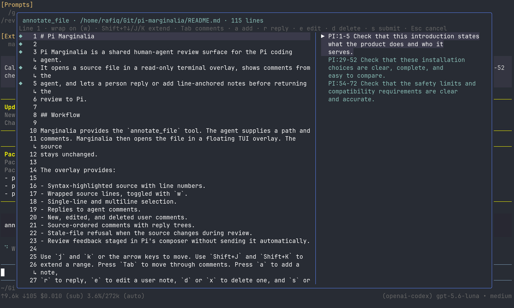

# Pi Marginalia

Pi Marginalia is a shared human-agent review surface for the Pi coding agent.
It opens a source file in a read-only terminal overlay, shows comments from the
agent, and lets a person reply or add line-anchored notes before returning the
review to Pi.



## Workflow

Marginalia provides the `annotate_file` tool. The agent supplies a path and
comments. Marginalia then opens the file in a floating TUI overlay. The source
stays unchanged.

The overlay provides:

- Syntax-highlighted source with line numbers.
- Wrapped source lines, toggled with `w`.
- Single-line and multiline selection.
- Replies to agent comments.
- New, edited, and deleted user comments.
- Source-ordered comments with reply trees.
- Stale-file refusal when the source changes during review.
- Review feedback staged in Pi's composer without sending it automatically.

Use `j` and `k` or the arrow keys to move. Use `Shift+J` and `Shift+K` to
extend a range. Press `Tab` to move through comments. Press `a` to add a note,
`r` to reply, `e` to edit a user note, `d` or `x` to delete one, and `s` or
`Enter` to stage the review. Press `Esc` to cancel.

## Install

Install Marginalia from npm:

```sh
pi install npm:pi-marginalia
```

Try it for one Pi session without saving it to your settings:

```sh
pi -e npm:pi-marginalia
```

Install the latest source from GitHub:

```sh
pi install git:github.com/rrvsh/pi-marginalia
```

Install it from a local checkout:

```sh
pi install /path/to/pi-marginalia
```

## Safety and compatibility

Marginalia reads one regular UTF-8 text file up to 256 KiB. It rejects likely
binary files and invalid line ranges. It never writes the reviewed source.
It checks the file hash before submission and refuses to stage feedback if the
file changed.

Pi loads the TypeScript extension directly. This package is tested with Pi
0.84.2 and uses Pi's supplied `@earendil-works/pi-coding-agent`,
`@earendil-works/pi-tui`, and `typebox` modules. The extension needs Pi's TUI
mode. It does not run in print, JSON, or RPC mode.

Pi extensions run with the user's permissions. Review the source before
installing third-party packages.

## Development

```sh
npm install
npm run typecheck
npm test
npm run validate-package
npm pack --dry-run
nix flake check
nix build .#pi-marginalia --no-link
```

The Nix flake supports `x86_64-linux` and `aarch64-darwin`. The development
shell provides Node 22 and npm tooling.

## Nix package

Build the package from GitHub:

```sh
nix build github:rrvsh/pi-marginalia#pi-marginalia
```

The flake exports `pi-marginalia` and `default`. The package installs an
npm-shaped Pi package tree and exposes `passthru.packagePath` for downstream
Home Manager modules.

## Updates and removal

Update the npm package:

```sh
pi update npm:pi-marginalia
```

Remove the npm package:

```sh
pi remove npm:pi-marginalia
```

## License

MIT. See [LICENSE](LICENSE).
